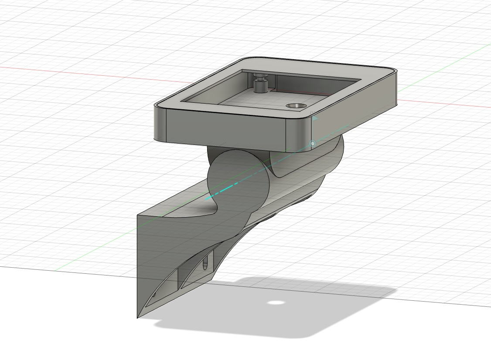
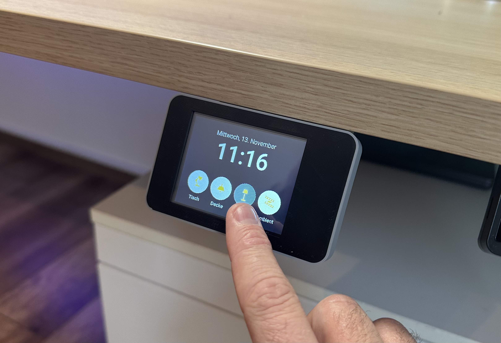
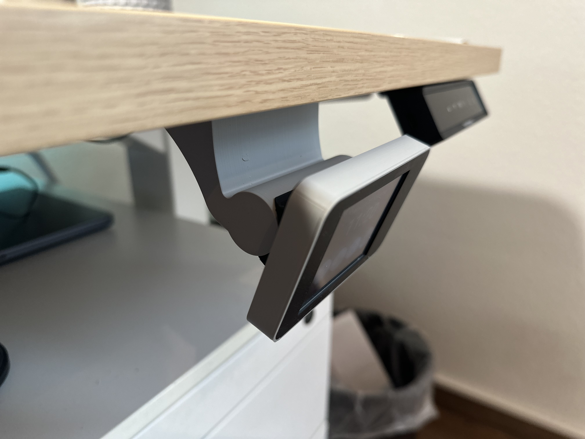
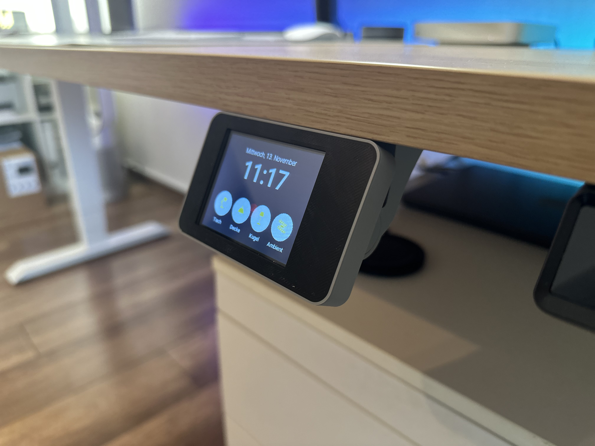
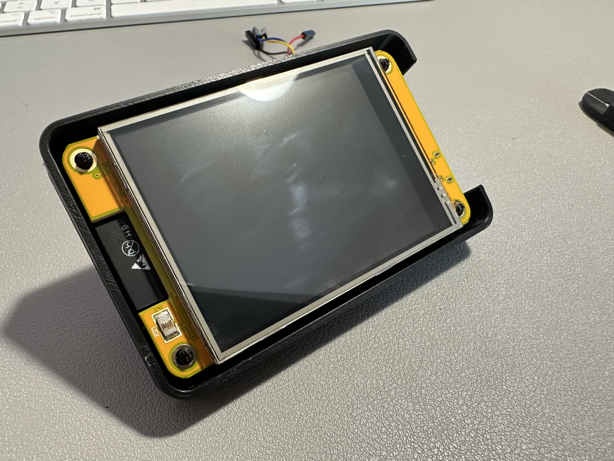
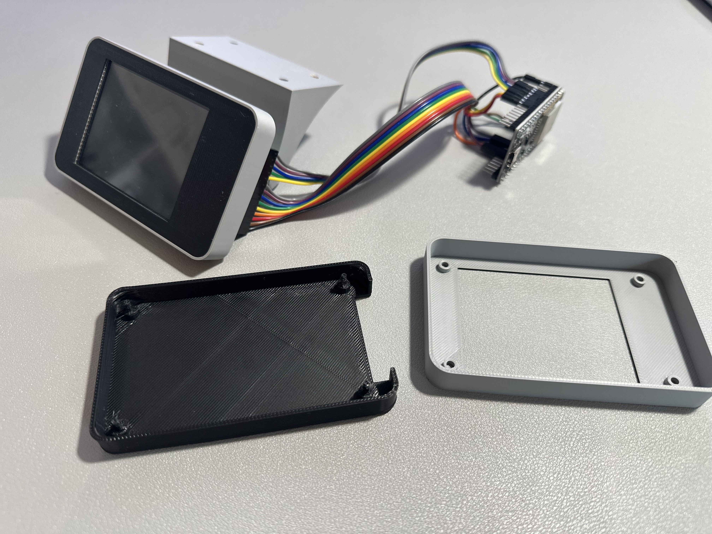
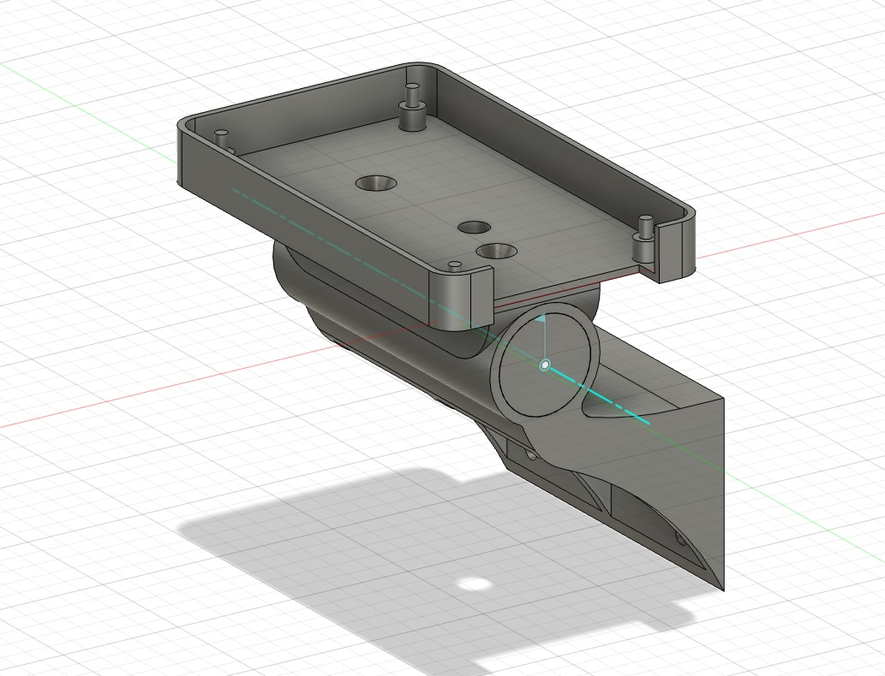
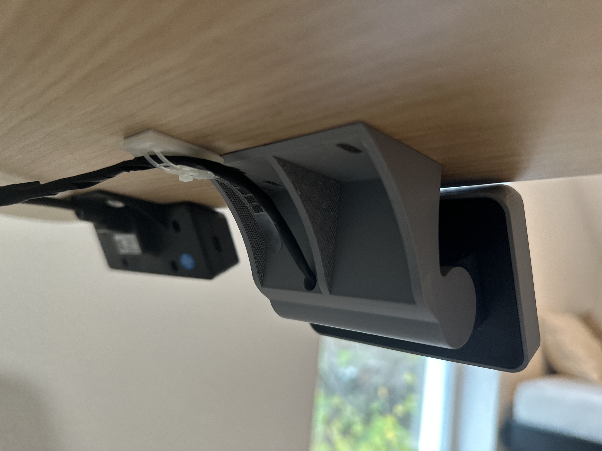

# 2.8" ILI9341 Touch Display Enclosure for ESP32 with Home Assistant Integration

An LVGL-powered ESPHome control panel for Home Assistant, built for the Cheap Yellow Display (CYD) and standalone ESP32 setups.

------------------------------------------------------------------------

This project provides complete ESPHome configurations and 3D-printable
enclosure files for a 2.8" ILI9341 touch display powered by an ESP32.

The goal of this project is to create a clean, wall- or desk-mounted
smart control panel that integrates seamlessly with Home Assistant.
It features a modern LVGL-based UI, real-time state synchronization, and
direct Home Assistant service calls --- all without requiring additional
automations.

The enclosure is designed for:

-   Clean cable routing
-   Adjustable viewing angle (±35° tilt)
-   Minimal footprint
-   Professional, integrated appearance

Two hardware variants are supported:

-   ✅ **ESP32-2432S028 (also known as the "Cheap Yellow Display
    Board")**
-   ✅ **Standalone ILI9341 + External ESP32 wiring variant**

The ESP32-2432S028 is commonly referred to as the **Cheap Yellow Display
(CYD)** board in the maker community.
It integrates the ESP32, ILI9341 display, touchscreen controller, and
backlight circuitry on a single board, making it the easiest and
cleanest option for this project.

------------------------------------------------------------------------

# 🆕 New Architecture (LVGL-Based UI)

This project now uses ESPHome LVGL instead of a classic display lambda
approach.

### What changed?

-   The UI is rendered fully using LVGL widgets
-   Buttons directly call Home Assistant services (homeassistant.action)
-   Button states are mirrored from Home Assistant entities
-   A centralized ui_refresh script keeps everything synchronized
-   UI updates are triggered:
    -   On boot
    -   Every minute (for clock updates)
    -   On Home Assistant state changes

This makes the system:

-   Cleaner
-   More responsive
-   Easier to extend
-   More maintainable

No Home Assistant automations are required anymore.

> 💡 Tip: If touch input is mirrored or rotated, adjust BOTH
> `display.transform` and `touchscreen.transform` — they must always match.

# ⚙️ Requirements

- Home Assistant installed
- ESPHome Add-on installed
- Basic ESPHome knowledge
- 3D printer access (optional)

---

# 🧪 Tested With

This project was tested using:

- **ESPHome 2026.2+**
- **Home Assistant 2026.2+**
- ESP32-2432S028 (Cheap Yellow Display / CYD)
- ILI9341 + XPT2046 standalone wiring variant

LVGL and `homeassistant.action` require relatively recent ESPHome versions.
If you are using an older version, please update before opening an issue.

# ⚠️ IMPORTANT -- Enable "Actions" in Home Assistant

Because this project uses:

homeassistant.action → light.toggle

You must allow the ESPHome device to perform Home Assistant service
calls.

### How to enable:

1.  Open Home Assistant

2.  Go to Settings

3.  Click Devices & Services

4.  Open the ESPHome integration

5.  Select your device

6.  Ensure:

    "Allow the device to perform Home Assistant actions" is enabled

Without this setting enabled, button presses will not trigger service
calls.

------------------------------------------------------------------------

# ✨ Features

-   LVGL-based lockscreen UI
-   Live time & date (via Home Assistant time)
-   4 configurable touch buttons
-   Direct Home Assistant service calls
-   Real-time state synchronization
-   Adjustable 3D-printed enclosure
-   Hidden cable routing
-   Works with Cheap Yellow Display (ESP32-2432S028) or external ESP32
    wiring

------------------------------------------------------------------------

# 📦 Hardware

## Option A -- ESP32-2432S028 (Cheap Yellow Display Board -- Recommended)

| Part                         | Price   | Comment                                         |
|------------------------------|---------|-------------------------------------------------|
| ESP32-2432S028			   | 15$     | 2.8" ILI9341 with integrated ESP                |
| 2x M4 3.5x16 screw (flathead)| 0.10$   | Screws to connect the mount case with the base  |

Advantages:

-   Single USB cable
-   Clean installation
-   No manual wiring
-   Widely available under the name "Cheap Yellow Display"

| ESP32-2432S028               | PIN          | Comment                                              |
|------------------------------|--------------|------------------------------------------------------|
| LCD                          |              |                                                      |
| clk_pin                      | GPIO14       | SPI LCD Clock                                        |
| mosi_pin                     | GPIO13       | SPI LCD MOSI (sometimes also labeled as SDI)         |
| miso_pin   	    		   | GPIO12       | SPI LCD MISO (sometimes also labeled as SDO	         |
| cs_pin                       | GPIO15       | Display CS                                           |
| dc_pin                       | GPIO2        | Display DC                                           |
| Touchscreen                  |              |                                                      |
| clk_pin                      | GPIO25       | SPI Touchscreen Clock                                |
| mosi_pin                     | GPIO32       | SPI Touchscreen MOSI (sometimes also labeled as DIN) |
| miso_pin                     | GPIO39       | SPI Touchscreen MISO (sometimes also labeled as DO)  |
| cs_pin                       | GPIO33       | Touchscreen CS                                       |
| interrupt_pin                | GPIO36       | Touchscreen Interrupt                                |
| LED                          |              |                                                      |
| ledc                         | GPIO21       | Backlight LED display                                |
| ledc                         | GPIO4        | Onboard LED (not used for this project)              |

------------------------------------------------------------------------

## Option B -- Standalone Display + ESP32

| Part                         | Price   | Comment                                         |
|------------------------------|---------|-------------------------------------------------|
| 2.8" ILI9341    			   | 8$      | 2.8" ILI9341                                    |
| ESP32 Wroom 32D   		   | 8$      | or some ESP32                                   |
| 2x M4 3.5x16 screw (flathead)| 0.10$   | Screws to connect the mount case with the base  |

Requires manual wiring according to the YAML pin configuration.

Use the wiring table below, which shows how to put everything together.

| ILI9341                      | PIN  ESP32   | Comment                                              |
|------------------------------|--------------|------------------------------------------------------|
| GND                          | GND          | Ground                                               |
| VCC                          | 3.3V         | Power                                                |
| LCD                          |              |                                                      |
| SCK                          | GPIO18       | SPI LCD Clock                                        |
| SDI (MOSI)                   | GPIO23       | SPI LCD MOSI (sometimes also labeled as SDI)         |
| SDO (MISO)   	    	   | GPIO19       | SPI LCD MISO (sometimes also labeled as SDO	         |
| CS                           | GPIO27       | Display CS                                           |
| D/C                          | GPIO26       | Display DC                                           |
| RESET                        | GPIO16        | Display Reset                                        |
| Touchscreen                  |              |                                                      |
| T_CLK                        | GPIO25       | SPI Touchscreen Clock                                |
| T_DO                         | GPIO35       | SPI Touchscreen MISO (sometimes also labeled as DO) |
| T_DIN                        | GPIO32       | SPI Touchscreen MOSI (sometimes also labeled as DIN)  |
| T_CS                         | GPIO33       | Touchscreen CS                                       |
| T_IRQ                        | GPIO34       | Touchscreen Interrupt                                |
| LED                          |              |                                                      |
| ledc                         | GPIO4        | Backlight LED display                                |

------------------------------------------------------------------------

# 🚀 Installation

1.  Open ESPHome in Home Assistant
2.  Create a new device
3.  Copy the appropriate YAML file
4.  Edit the **USER CONFIG / substitutions** section at the top of the YAML (entities, labels, icons)
5.  Adjust WiFi credentials
6.  Flash the device

Available YAML variants:

-   esp32-2432s028.yml
-   ili9341-with-external-esp.yml

Choose the one matching your hardware.

------------------------------------------------------------------------

# ⚙️ Button Mapping (USER CONFIG)

Both YAML variants include a **USER CONFIG / substitutions** section at the top of the file.
This is the intended place to customize the 4 buttons without touching the LVGL layout.

You can change per button:

- Entity ID (e.g. `light.kitchen`)
- Label text (caption under the icon)
- Icon code (MDI glyph)

⚠️ **Default action:** All buttons currently call `homeassistant.action -> light.toggle`.  
If you want a different service (e.g. `switch.toggle`, `scene.turn_on`, `script.turn_on`, etc.),
you must edit the `homeassistant.action` block inside each button.

💡 If you change the icon glyph, also update the **MDI font glyph list** in the YAML
so ESPHome includes the new icon in the font.

------------------------------------------------------------------------

# 🧠 System Logic Overview

### Button Flow

1.  LVGL button is pressed
2.  ESPHome calls Home Assistant service (light.toggle)
3.  Home Assistant updates entity state
4.  ESPHome mirrors the entity as binary_sensor
5.  ui_refresh updates the button checked state

This guarantees full synchronization between UI and Home Assistant.

------------------------------------------------------------------------

# 🔧 Customization

For most setups, you only need to edit the **USER CONFIG / substitutions** section in the YAML.

You can also:

-   Add more buttons / pages
-   Change service calls (the default is `light.toggle`)
-   Modify fonts and icon glyphs
-   Adjust colors / theme
-   Change date language
-   Adjust transforms for your panel

If touch alignment is wrong, ensure `display.transform` and `touchscreen.transform`
are **identical** (they must always match).

------------------------------------------------------------------------

# 🖨 3D Printing

See /3d_print folder for STL files and Fusion360 source.

Designed for:

-   Under-desk mounting
-   Wall mounting
-   Adjustable viewing angle
-   Hidden cable routing

------------------------------------------------------------------------

# ⚠️ Disclaimer

This is a hobby project and considered work-in-progress.

Feel free to fork, remix and improve it.

# Other

# More projects
Looking for more cool projects using this display? Check out the [LoctekMotion Touch Display GitHub repository](https://github.com/3DJupp/LoctekMotion-TouchDisplay)! This awesome project takes the same 2.8" ILI9341 touchscreen setup and repurposes it—not for lights, but for controlling a height-adjustable Flexispot desk with ease. If you're into smart home automation and custom builds, it's definitely worth a look!

